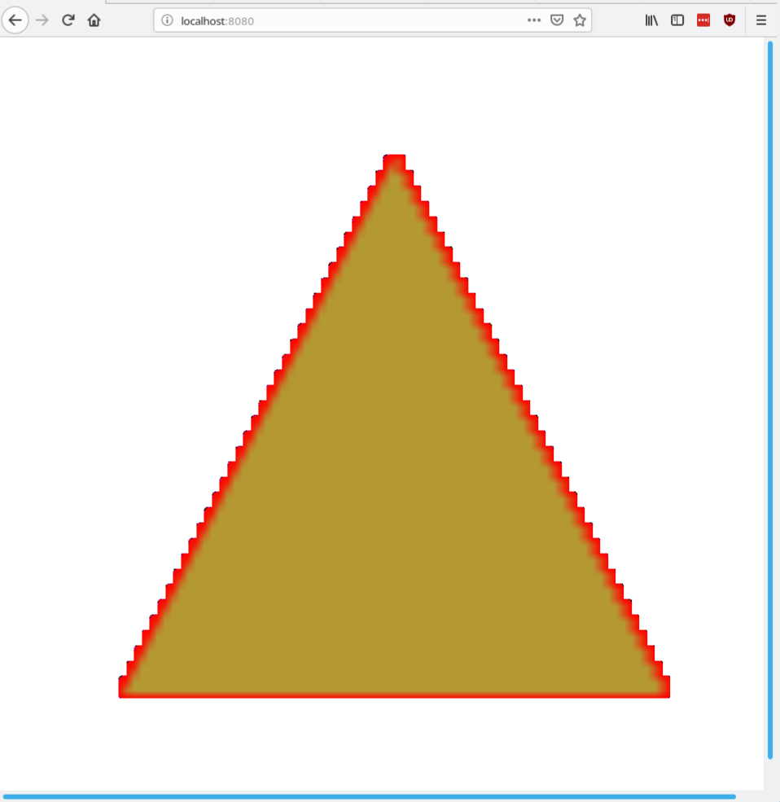

# rugl

A clone of [regl](regl.party) a functional abstraction for wegbl.

The goal of this crate is to provide a simple Rust macro for stateless WebGL animations with minimal work!

## Example
```rust
extern crate rugl;
extern crate wasm_bindgen;
use rugl::prelude::*;

rugl!(
    vertex: {
        "
            precision mediump float;
            attribute vec2 position;
            void main() {
                gl_Position = vec4(position, 0, 1);
            }
        "
    },
    
    fragment: {
        "
            precision mediump float;
            uniform vec3 color;
            void main() {
                gl_FragColor = color;
            }
        "
    },
    
    attributes: {
        position: [
            [-1.0, 0.0],
            [0.0, -1.0],
            [1.0, 1.0]
        ]
    },

    uniforms: {
        color: [1.0, 0.0, 0.0, 1.0]
    },

    count: { 3 }
);
```

## Quickstart

Create a new library via cargo

1. `cargo new --lib rugl_test && cd rugl_test`

Install necessary files and toolchain

2. ` bash <(curl -s https://raw.githubusercontent.com/Thomspoon/rugl/master/install_rugl.sh)`

Replace the code in your lib.rs with the following:

```rust
extern crate rugl;
extern crate wasm_bindgen;
use rugl::prelude::*;

rugl!(
    vertex: {
        "
            attribute vec4 position;
            void main() {
                gl_Position = position;
            }
        "
    },
    fragment: {
        "
            precision mediump float;
            uniform vec4 color;

            void main() {
                gl_FragColor = color;
            }
        "
    },
    attributes: {
        position: [
            [-0.7, -0.7, 0.0],
            [ 0.7, -0.7, 0.0],
            [ 0.0,  0.7, 0.0]
        ],
    },
    uniforms: {
        color: [0.0, 0.9, 0.5, 0.3]
    },

    count: { 3 }
);
```

Add this to your Cargo.toml:

```rust
[package]
//... Other things
build = "build.rs"

[lib]
crate-type = ["cdylib"]

[dependencies]
rugl = { git = "https://github.com/Thomspoon/rugl.git" }
js-sys = "0.3.10"
wasm-bindgen = "^0.2"

[dependencies.web-sys]
version = "0.3.10"
features = [
    "console",
    "Document",
    "Element",
    "Window",
    "WebGlBuffer",
    "WebGlProgram",
    "WebGlShader",
    "WebGlRenderingContext",
    "WebGlUniformLocation",
    "WebGpuShaderStage",
    "HtmlCanvasElement"
]
```

3. Build your crate

`cargo +nightly build --target wasm32-unknown-unknown`

4. Install npm modules

`npm install`

5. Serve your crate

`npm run serve`

6. Go to http://localhost:8080, and you should see the photo below:



## TODO
- [ ] Run Clippy
- [ ] Implement Animation Capability
- [ ] Cleanup Code and Publish Crate
- [ ] Spruce Up Macro to Support Non-bracken Syntax
