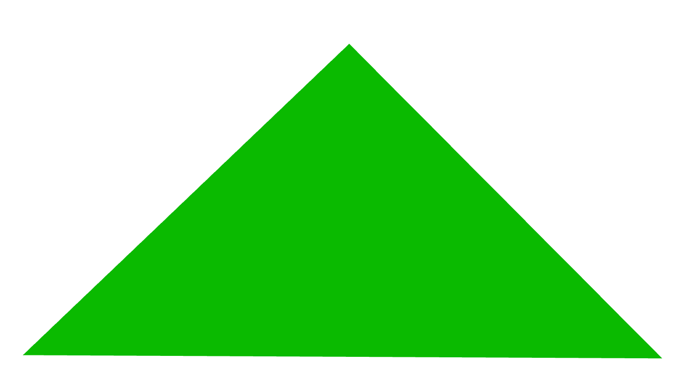

# rugl

A clone of [regl](regl.party) a functional abstraction for wegbl.

The goal of this crate is to allow you to design effortless animations utilizing a single macro in a
single file, where all the WebGL elements are abstracted away from you. All you need to do is
provide the shaders, attributes, and uniforms that you want to use!

## Example

Note: This assumes you are using the 2018 edition of Rust, otherwise you might have to extern crates
manually.

```rust
use rugl::prelude::*;

rugl!(
    vertex: {
        "
            precision mediump float;
            attribute vec2 position;
            uniform float angle;

            void main() {
            gl_Position = vec4(
                cos(angle) * position.x + sin(angle) * position.y,
                -sin(angle) * position.x + cos(angle) * position.y, 0, 1);
            }
        "
    },
    fragment: {
        "
            precision mediump float;
            uniform vec4 color;

            void main() {
                gl_FragColor = color;
            }
        "
    },
    attributes: {
        position: [
            [-0.7, -0.7, 0.0],
            [ 0.7, -0.7, 0.0],
            [ 0.0,  0.7, 0.0]
        ],
    },
    uniforms: {
        color: |tick: f64| {[
            (0.02 * (0.001 * tick)).sin(),
            (0.02 * (0.02 * tick)).cos(),
            (0.02 * (0.3 * tick)).sin(),
            1.0
      ]},
        angle: |tick: f64| { 0.01 * tick }
    },

    count: { 3 }
);
```

## Quickstart

Create a new library via cargo

1. `cargo new --lib rugl_test && cd rugl_test`

Install necessary files and toolchain

2. ` bash <(curl -s https://raw.githubusercontent.com/Thomspoon/rugl/master/install_rugl.sh)`

Replace the code in your lib.rs with the following:

```rust
use rugl::prelude::*;

rugl!(
    vertex: {
        "
            precision mediump float;
            attribute vec2 position;
            uniform float angle;

            void main() {
            gl_Position = vec4(
                cos(angle) * position.x + sin(angle) * position.y,
                -sin(angle) * position.x + cos(angle) * position.y, 0, 1);
            }
        "
    },
    fragment: {
        "
            precision mediump float;
            uniform vec4 color;

            void main() {
                gl_FragColor = color;
            }
        "
    },
    attributes: {
        position: [
            [-0.7, -0.7, 0.0],
            [ 0.7, -0.7, 0.0],
            [ 0.0,  0.7, 0.0]
        ],
    },
    uniforms: {
        color: |tick: f64| {[
            (0.02 * (0.001 * tick)).sin(),
            (0.02 * (0.02 * tick)).cos(),
            (0.02 * (0.3 * tick)).sin(),
            1.0
      ]},
        angle: |tick: f64| { 0.01 * tick }
    },

    count: { 3 }
);
```

Add this to your Cargo.toml:

```rust
[package]
//... Other things
build = "build.rs"

[lib]
crate-type = ["cdylib"]

[dependencies]
rugl = { git = "https://github.com/Thomspoon/rugl.git" }
```

3. Build your crate

`cargo +nightly build --target wasm32-unknown-unknown`

4. Install npm modules

`npm install`

5. Serve your crate

`npm run serve`

6. Go to http://localhost:8080, and you should see the photo below:



## TODO
- [x] Implement Animation Capability
- [ ] Address TODOs in code
- [ ] Address poor build system
- [ ] Run Clippy
- [ ] Cleanup Code and Publish Crate
- [ ] Spruce Up Macro to Support Non-bracken Syntax
